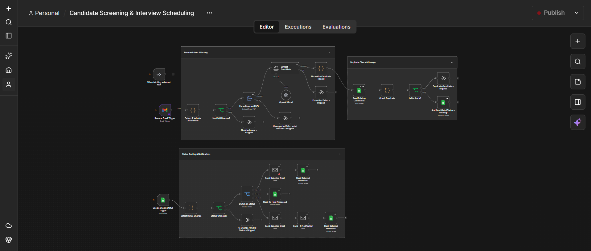
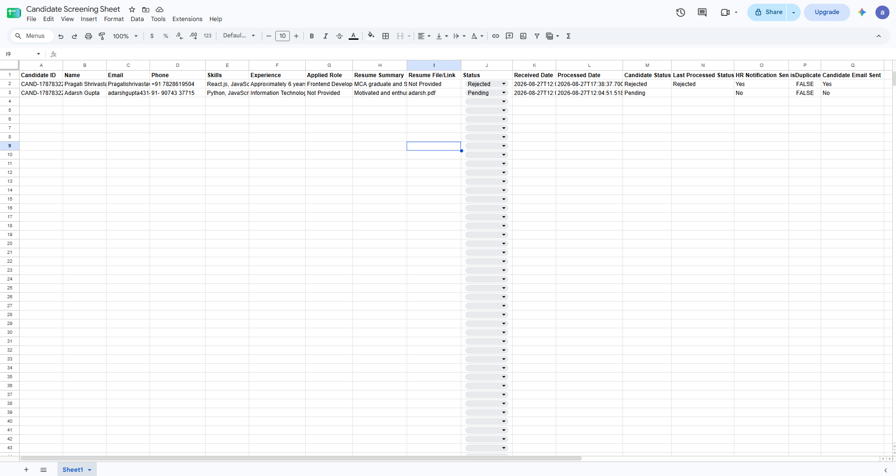
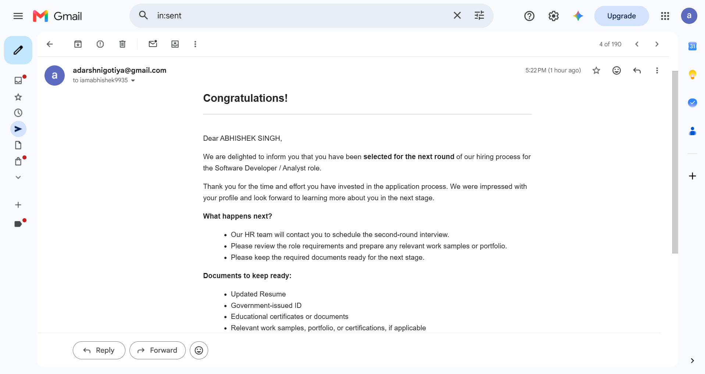
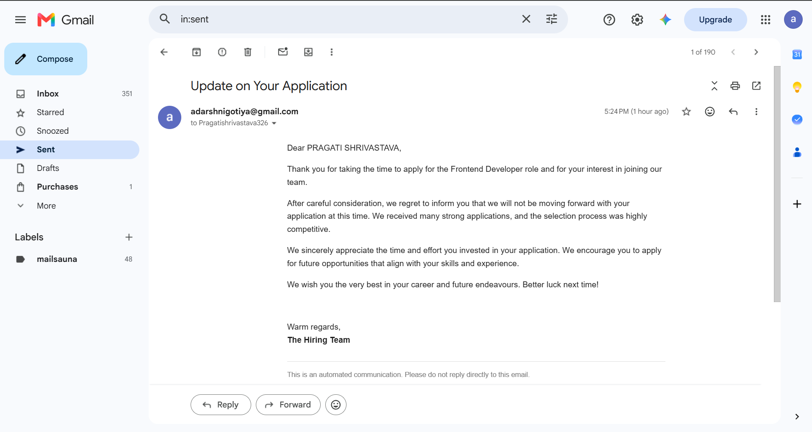
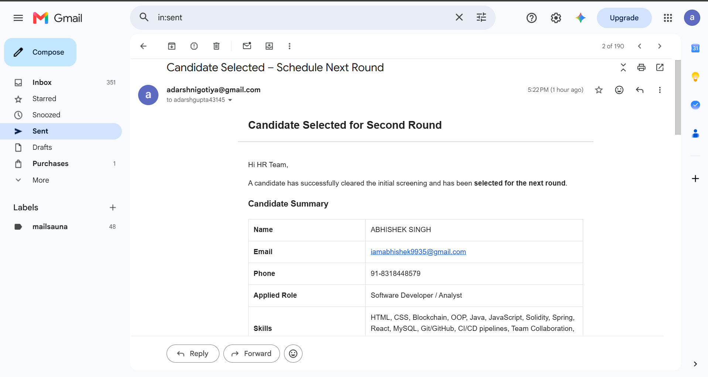

# candidate-screening-automation
Candidate Screening and Interview Scheduling Automation using n8n, Google Sheets, and Email Automation
# Candidate Screening & Interview Scheduling Automation

An automated candidate screening and interview scheduling workflow built using **n8n, Google Sheets, Gmail, and OpenAI**.

## 📌 Project Overview

This project automates the candidate recruitment process from resume submission to candidate status updates and email notifications.

The workflow processes incoming resumes, extracts candidate information, stores the data in Google Sheets, checks for duplicate candidates, and automatically sends notifications based on the candidate's selection status.

## 🚀 Features

- Resume received through Gmail trigger
- Attachment validation
- Resume PDF parsing
- AI-powered candidate detail extraction
- Candidate information normalization
- Duplicate candidate detection
- Candidate data storage in Google Sheets
- Candidate status monitoring
- Automatic selection email
- Automatic rejection email
- HR notification for selected candidates
- Google Sheet status updates

## 🔄 Workflow Process

1. A candidate submits a resume through email.
2. The Gmail Trigger starts the workflow.
3. The resume attachment is extracted and validated.
4. The PDF resume is parsed.
5. Candidate details such as Name, Email, Phone, Skills, Experience, Applied Role, and Resume Summary are extracted.
6. The candidate data is normalized.
7. Duplicate candidates are detected.
8. Unique candidate information is stored in Google Sheets.
9. HR can update the candidate status in Google Sheets.
10. Based on the status:
   - Selected candidates receive a next-round confirmation email.
   - Rejected candidates receive a respectful rejection email.
   - HR receives a notification to schedule the second-round interview.
11. Candidate processing status is updated in Google Sheets.

## 🛠️ Technologies Used

- n8n
- Gmail
- Google Sheets
- OpenAI
- JavaScript
- PDF Resume Parsing

## 📊 Candidate Information Stored

The following information is maintained in Google Sheets:

- Candidate ID
- Name
- Email
- Phone
- Skills
- Experience
- Applied Role
- Resume Summary
- Resume File/Link
- Status
- Received Date
- Processed Date
- Candidate Status
- Last Processed Status
- Candidate Email Sent
- HR Notification Sent

## 📸 Screenshots

### Complete n8n Workflow



### Google Sheet



### Selected Candidate Email



### Rejected Candidate Email



### HR Notification Email



## 📂 Repository Structure

```text
candidate-screening-automation/
│
├── Candidate-Screening-Automation.json
├── README.md
│
└── screenshots/
    ├── workflow.png.png
    ├── google-sheet.png.png
    ├── selected-candidate-email.png.png
    ├── rejected-candidate-email.png.png
    └── hr-notification-email.png.png
